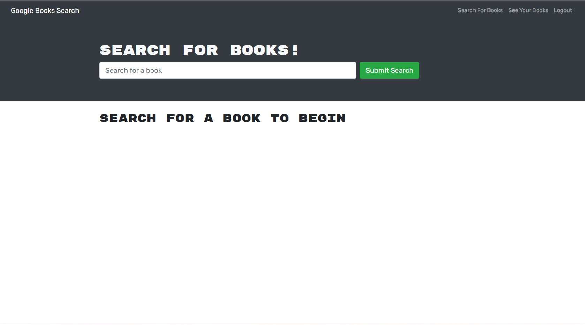
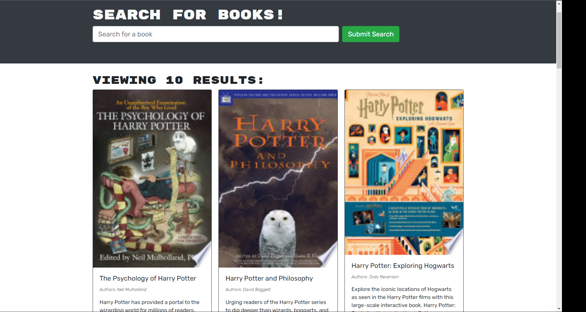
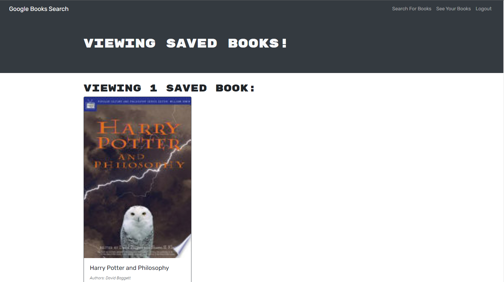
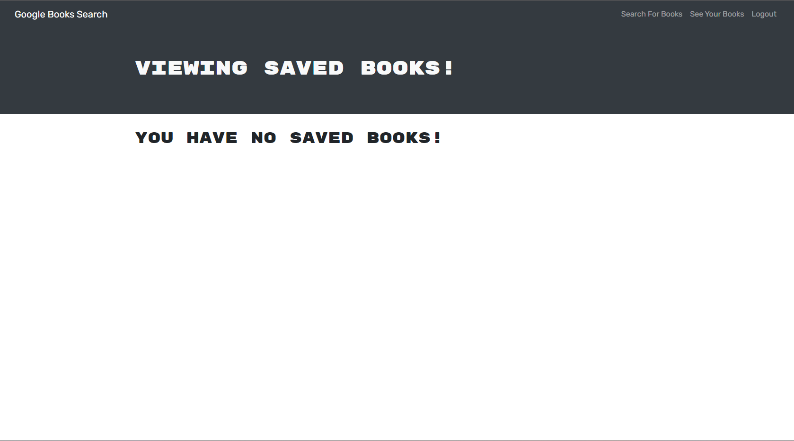

# Book Search Engine

## Table of Contents:

1. [Description](#description)
2. [Installation](#installation)
3. [Usage](#usage)
4. [License](#license)
5. [Contributing](#contributing)
6. [Test](#tests)
7. [Questions](#questions)

## Description:

In this challenge I will take a Google Book Api search engine built with a RESTful Api and convert it to use Graphql

## Installation:

Mongo, Express,React and Node will be needed to use this application and well as apollo server

## Usage:

This project is used to search and save books using the google book api

## License:

MIT
[Link to license](https://opensource.org/licenses/MIT)

## Contributing:

Anthony Speece is contributing to this project

## Tests:

user testing was done on this project

## Questions:

GitHub Username: A-Speece
Email: anthonyspeece@gmail.com
Heroku Application:
Screenshots:

